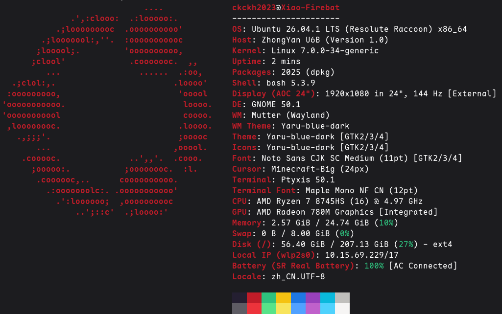

本文介绍 Linux 系统安装完成后的**初步配置**：系统更新、软件源更换、显卡驱动安装、中文输入法、双系统时间、防火墙及常用软件，**其余高级内容将在其他文档专门介绍**。

>[!TIP]
> Linux 系统内的大量内容涉及命令行，建议设置快捷键 `Super + T` 快速启动终端！

---

## 系统更新

```bash
sudo apt update
sudo apt upgrade -y
```

> 此配置可以确保系统内核、固件、驱动等处于最新状态，减少后续问题，我写的关于 apt 仓库的文档[点此](https://xiao-blog.top/docs/article?id=linux-guide&sub=software-package-guide&sub2=apt-repository-guide)查看。

---

## 软件源配置

国内访问 Ubuntu 官方源速度较慢，有需要可更换为国内镜像源。

> **Ubuntu 24.04 起采用新格式 `/etc/apt/sources.list.d/ubuntu.sources`**，旧版仍是 `/etc/apt/sources.list`，此处使用 24.04+。

```bash
sudo cp /etc/apt/sources.list.d/ubuntu.sources /etc/apt/sources.list.d/ubuntu.sources.bak # 备份原软件源
sudo sed -i 's|http://archive.ubuntu.com/ubuntu|https://mirrors.tuna.tsinghua.edu.cn/ubuntu|g' /etc/apt/sources.list.d/ubuntu.sources
sudo apt update
```
> [!TIP]
> 其他可选镜像：阿里 `https://mirrors.aliyun.com/ubuntu`、中科大 `https://mirrors.ustc.edu.cn/ubuntu`。更换后务必执行 `sudo apt update` 使新源生效。

> [!CAUTION]
> 清华源由于削减镜像存储份额导致**许多镜像可能无法下载**，如发现软件包缺失请不要犹豫，直接更换镜像源！

---

## 显卡驱动

### 判断显卡类型

```bash
lspci | grep -i vga
```

> 核显使用预装的开源驱动几乎不需要多余配置，AMD 独显安装官方闭源驱动使用 ROCm 的教程后续出。

### 安装方法

- **图形界面**

打开“软件和更新 → 附加驱动”，选择推荐的 NVIDIA 驱动，点击应用更改，然后重启。

> [!CAUTION]
> 此方法可能不生效，如果不生效请尝试下个方法。

- **命令行（Ubuntu 版本）**

```bash
sudo apt update
ubuntu-drivers devices
sudo ubuntu-drivers autoinstall
```

> [!TIP]
> 如果你开启了 `Secure Boot`，命令执行完会出现蓝色界面提示使用 MOK 密钥签名，此时你只需输入你自己设置的密码；随后重启，重启后会出现相同的蓝色界面，选择 `Enroll MOK`，输入刚才的密码即可安装成功。

- **直接安装开发包**

```bash
sudo apt update
sudo apt install nvidia-driver-XXX-open # XXX 需替换，如 565、595 等等
```

`-open` 后缀为 NVIDIA 开源内核模块版，同时拉入运行 CUDA 程序所需的用户态库，无需再单独装 CUDA 运行时。若要编译开发，再 `sudo apt install cuda-toolkit` 即可。

**注意几个坑点**：

- 包名中的版本号**按需替换**，可用 `apt search 'nvidia-driver-.*-open'` 查看可用版本；
- Secure Boot 场景同样需要 MOK 签名；
- 建议优先使用 `open` 版本保证驱动程序能安装上，后续可装闭源版。

无论什么办法，只要重启后输入 `nvidia-smi`，终端输出能看到显卡型号、驱动版本、显存信息，就代表安装成功。

---

## 系统设置

### 中文输入法配置

Ubuntu 24.04+ 推荐使用 **fcitx5** 框架：

```bash
sudo apt install fcitx5 fcitx5-chinese-addons fcitx5-config-qt fcitx5-frontend-gtk3 fcitx5-frontend-gtk4 fcitx5-frontend-qt5 fcitx5-frontend-qt6 fcitx5-pinyin
```

#### 安装后处理

Ubuntu 默认预装 IBus 及其引擎，会与 fcitx5 争抢输入法总线名，**需卸载引擎，保留核心库**：

```bash
sudo apt purge -y ibus-libpinyin ibus-table ibus-table-wubi ibus-table-cangjie* ibus-chewing ibus-m17n
```

#### 配置环境变量

我们需要在 `~/.config/environment.d` 创建 `fcitx5.conf` 文件，填入以下内容：

```conf
GTK_IM_MODULE=fcitx
QT_IM_MODULE=fcitx
QT_IM_MODULES=fcitx
XMODIFIERS=@im=fcitx
SDL_IM_MODULE=fcitx
CLUTTER_IM_MODULE=fcitx
```

改完必须**注销重新登录或重启**，`environment.d` 只在会话启动时由 systemd 读取。

#### 设置开机自启

```bash
mkdir -p ~/.config/autostart
cp /usr/share/applications/org.fcitx.Fcitx5.desktop ~/.config/autostart/
```

#### 配置输入法

终端输入 `fcitx5-configtool`，在「输入法」页把 `拼音` 加入左侧列表。

> [!TIP]
> 若需要开机默认中文，编辑 `~/.config/fcitx5/config` 使得 `[Behavior]` 项为 `ActiveByDefault=True`。

#### 解决候选框位置错乱的问题

fcitx5 会主动弹通知提示安装输入法面板这个 GNOME Shell 扩展：https://extensions.gnome.org/extension/261/kimpanel/

**原因**：GNOME 的 Wayland `input-method` 协议**不传递光标坐标**，所以输入法候选框的位置偏离输入框！

> 在[此链接](https://extensions.gnome.org/extension/261/kimpanel/)页面安装扩展后重启即可解决此问题。

---

### 双系统时间配置

Windows 把硬件时钟当作本地时间，Linux 当作 UTC，导致装双系统后切换系统时间会差 8 小时。最简单的解决方法是让 Linux 也使用本地时间：

```bash
sudo timedatectl set-local-rtc 1
```

> [!TIP]
> 也可以在 Windows 中以管理员身份打开 CMD，复制并运行以下命令 `Reg add HKLM\SYSTEM\CurrentControlSet\Control\TimeZoneInformation /v RealTimeIsUniversal /t REG_DWORD /d 1 /f` 运行即可恢复正常。

---

## 防火墙

Ubuntu 默认自带 **UFW**，**有需要**可以设置，命令简单：

```bash
sudo ufw allow ssh # 启用该端口才可以被 SSH 连接
sudo ufw allow 80/tcp
sudo ufw allow 443/tcp
sudo ufw enable
sudo ufw status verbose
```

---

## 安装常用软件

> [!TIP]
> 如果你是 C/C++ 开发者，可以使用 `sudo apt install build-essential` 立刻配置好开发环境，可以去[此文档](https://xiao-blog.top/docs/article?id=c-cpp-guide&sub=compile-introduction&sub2=gcc-guide)查看。

这些是一些命令行工具，你也可以去我的[分享页](https://xiao-blog.top/share/)寻找好用的 Linux 桌面应用。

```bash
sudo apt install git curl vim # 此为一般常用工具等，后续更新
```

> [!TIP]
> 你可以学习包管理系统，Ubuntu 使用的是 apt 仓库管理系统，可以查看[此文档](https://xiao-blog.top/docs/article?id=linux-guide&sub=software-package-guide&sub2=apt-repository-guide)；关于 Ubuntu 强制推行的风评较差的 snap 仓库管理系统卸载方法可以查看[此文档](https://xiao-blog.top/docs/article?id=linux-guide&sub=software-package-guide&sub2=snap-uninstall-guide)。

最后，你可以在终端输入 `sudo apt install fastfetch -y`，安装完成后输入 `fastfetch` 就能看到下面的内容啦！



> 拿这张图片展示你的 Linux 系统去吧！Arch 教徒都爱这么玩～虽然我们不是～